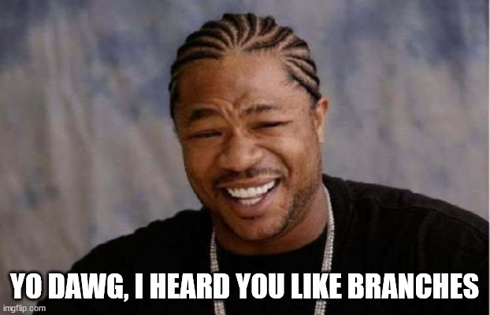

# branch-dawg

Power tool for managing your git branches.



## Usage

> ⚠️ Warning: This tool is a WIP. The API may change at any time and may break your branches.

To list all branches in a git repository, run:

```rust
branch-dawg list
```

This outputs all local branches.
